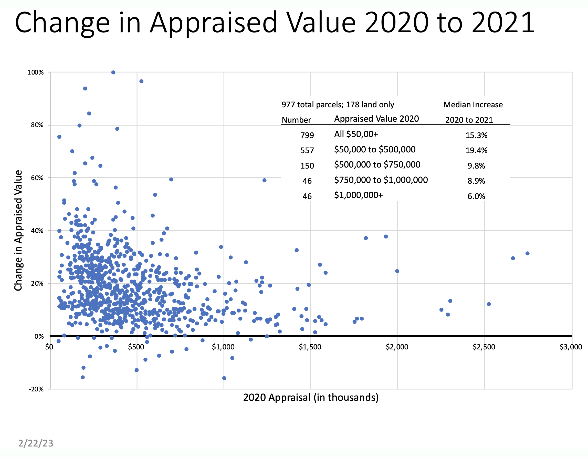
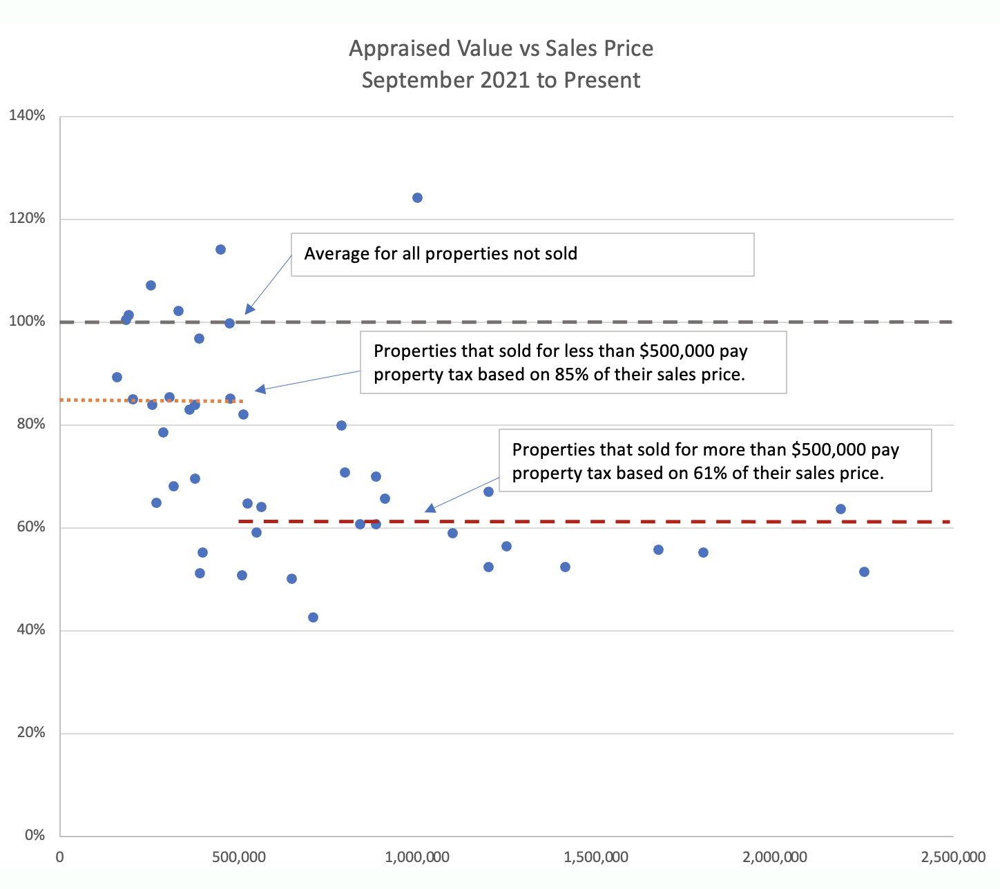

# Another way to look at the data

At Town Meeting (March 14), the Town will be asked to vote on Article #16 to perform a Full Statistical Revaluation. The rest of this page shows several graphs that present the unfairness in different ways.

How will a revaluation help? A revaluation allows the town to adjust the factors that set _each_ property's appraisal to match current conditions, ironing out the kinks and problems from the 2021 revaluation.

Here are a couple different ways to look at the data:

## Graph #1: How much did your _Appraisal_ change?

Did your property appraisal (the base for computing your tax bill) increase in the prior revaluation of 2021? The entire town went up by a median of 15.3%. But there was a clear unfairness. The graph shows:

- The least expensive properties (under $500,000) went up by 19.4%
- More expensive properties increased by smaller amounts...
- Properties above $1,000,000 increased only 6%

Because those lower-price properties appraisals increased more, they shoulder an unfair portion of the total tax that must be raised to support the town.

A town-wide revaluation will give Lyme a chance to rebalance our appraisals.

## Graph #2: How much did your _property tax_ change?

In 2021, the average property tax increase was not the same for all properties: This graph shows:

- Properties under \$500,000 saw their tax bill increase by 8.9%
- Properties above \$500,000 saw a tax of only 4.4%.

Because those lower-price property's tax bills increased more "than average", they shoulder an unfair portion of the total amount that must be raised to support the town.

A town-wide revaluation will give Lyme a chance to rebalance our appraisals.

## Graph #3: The unfairness continues into 2022

Recent sales &mdash; in the last 15 months &mdash; continue the same pattern from the 2021 revaluation. Properties that sold for more than \$500,000 had an appraised value considerably lower (proportionally) than less expensive properties. This graph shows:

- The appraised value for properties that sold above $500,000 is far below their sale price
- The appraised value for properties that sold for less than $500,000 is much closer to their sale price

Since property tax bills are based on the appraised value, the more expensive properties pay a tax bill on a smaller percentage of their "fair market value".

A town-wide revaluation will give Lyme a chance to rebalance our appraisals.

_Updated 28 February 2023_
